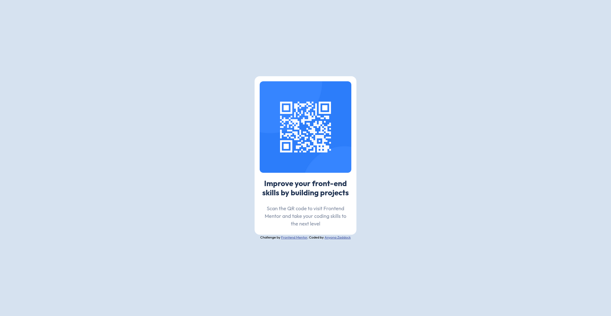

# Frontend Mentor - QR code component solution

This is a solution to the [QR code component challenge on Frontend Mentor](https://www.frontendmentor.io/challenges/qr-code-component-iux_sIO_H). Frontend Mentor challenges help you improve your coding skills by building realistic projects. 

## Table of contents

- [Overview](#overview)
  - [Screenshot](#screenshot)
  - [Links](#links)
- [My process](#my-process)
  - [Built with](#built-with)
- [Author](#author)
- [Acknowledgments](#acknowledgments)

**Note: Delete this note and update the table of contents based on what sections you keep.**

## Overview

  A beginner friendly challenge especially for those who are getting started on working on projects.

### Screenshot

### Links

- Solution URL: [GITHUB](https://github.com/zacc-anyona/QR-CODE-COMPONENT-FRONTEND-MENTOR)
- Live Site URL: [View using NETLIFY](https://qr-code-frontend-mentor-anyona.netlify.app/)

## My process

  I used a mobile first a appoach then proceeded to desktop design.

### Built with

- Semantic HTML5 markup
- CSS custom properties
- Flexboxor anyone viewing your solution or for yourself when you look back on this project in the future.**

## Author

- Frontend Mentor - [@zacc-anyona](https://www.frontendmentor.io/profile/zacc-anyona)
- Twitter - [@anyona_zadocc](https://www.twitter.com/anyona_zadocc)

## Acknowledgments

  I want to thank myself for committing to complete this challenge.
  I want to thank the Frontend Mentor team for creating this challenge and making it available for everyone.
